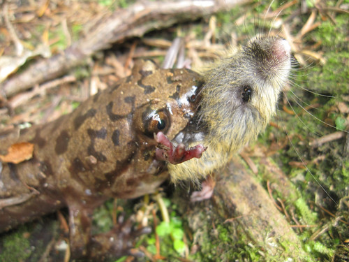
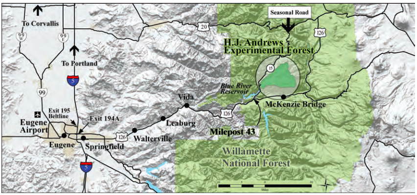

```{r setup, include=FALSE, warning = FALSE}
knitr::opts_chunk$set(echo = FALSE)
```



***Image 1:** A Pacific Giant Salamander (Dicamptodon tenebrosus), enjoys its lunch.
**Source:** [Industrius Info](https://www.industrious.info/55/08768-pacific-giant-salamander-eating.html)*

### **Introduction**

Since 1993, data on Pacific Giant Salamanders has been collected in/along Mack Creek, part of the H.J. Andrews Experimental Forest in Western Cascade Mountains of Oregon. This data collection is part of a [larger effort](http://andlter.forestry.oregonstate.edu/data/abstract.aspx?dbcode=AS006), begun in 1987 to monitor local cutthroat trout populations (2). The H.J. Andrews Experimental Forest is a research site supported jointly by the University of Oregon and the U.S. Forest Service, and funded as part of the National Science Foundation’s Long-Term Ecological Research program (1). Data collection for Pacific Giant Salamanders occurs in two distinct areas, a coniferous old-growth forest and a clear-cut area (c. 1963) (2). Observations gathered pertaining to salamander abundance, weight, type, and location can provide insight as to how the species is affected by factors such as climate change, land use, and other disturbances over time (1).


### **Data and Methods**


***Image 2:** Location overview of H.J. Andrews Experiment Forest
**Source:** [H.J. Andrews Experimental Forest](https://andrewsforest.oregonstate.edu/data/map)*


***Image 3:** H.J. Andrews Experiment Forest
**Source:** [H.J. Andrews Experimental Forest](https://andrewsforest.oregonstate.edu/data/map)*


### **Results**

```{r, include = FALSE}
library(tidyverse)
library(janitor)
library(beeswarm)
library(car)
library(ggbeeswarm)
library(kableExtra)
library(lubridate)
library(effsize)
library(DT)
library(plotly)
library(RColorBrewer)
```

#### A: Visualizing salamander abundance between old growth and clear cut sections of Mack Creek

```{r echo=FALSE}
salamanders <- read_csv("mack_creek_vertebrates.csv") %>% 
  clean_names() %>% 
  filter(species == "DITE") %>% 
  mutate(sampledate = lubridate::mdy(sampledate)) %>% 
  mutate(year = lubridate::year(sampledate)) %>% 
  mutate(section = replace(section, section == "OG", "Old growth")) %>%
  mutate(section = replace(section, section == "CC", "Clear cut")) %>% 
  mutate(unittype = replace(unittype, unittype == "P", "Pool")) %>% 
  mutate(unittype = replace(unittype, unittype == "C", "Cascade")) %>%
  mutate(unittype = replace(unittype, unittype == "SC", "Side channel"))

salamanders_counted <- salamanders %>%
  count(year, section)
  

salamander_line <- ggplot(data = salamanders_counted,
                          aes(x = year,
                              y = n,
                              color = section)) +
  geom_line(size = 2) +
  theme_bw() +
  scale_x_continuous(expand = c(0,0)) + 
  scale_y_continuous(expand = c(0,0)) +
  labs(x = "Year", y = "Annual count") +
  ggtitle("Annual count of salamanders (Onchorhyncus clarkii)")

salamander_line
```
***Figure 1:** Salamander abundance*


#### B: Salamander counts by channel classification


***Table 1:** Salamander counts by channel classification. In 2017, the highest abundance of salamanders in both clear cut (CC) and old growth (OG) forests were found in cascades (67.1% and 62.8%, respectively), followed by side channels (24.5% and 23.1%), and then pools (8.4% and 14.1%).*

```{r}

salamanders_2017 <- salamanders %>%   # contains only section and unittype
  filter(year == "2017") %>% 
  select(section, unittype, weight) %>% 
  filter(unittype != "IP")


# finding salamander counts by section and unit type (cascade, pool, side channel)
salamander_2017_counts <- salamanders_2017 %>%  
  count(section, unittype)


# making a table / wider format / contingency table
salamander_2017_table <- salamander_2017_counts %>% 
  pivot_wider(names_from = unittype,
              values_from = n)

# making a nicer table! 
salamander_2017_props <- salamander_2017_table %>% 
  adorn_percentages(denominator = "row") %>% 
  adorn_pct_formatting(digits = 1) %>% 
  adorn_ns(position = "front") %>% 
  rename(Section = section)


kable(salamander_2017_props) %>% 
  kable_styling()

# Need to rename CC and OG to Clear cut and Old growth!
# Add table caption above table

```

#### C: Impacts of forest condition of salamander location


```{r, include = FALSE}
# Is there an effect of forest condition (OG vs. CC) on where salamanders are found (channel classification)?

chi_counts <- salamander_2017_table %>% 
  select(-section)

chi_counts
```


```{r, include = FALSE}
#H0:There is no significant association between forest condition and salamander location. Or, forest condition and salamander location are independent of one another.

salamander_chi <- chisq.test(chi_counts)

salamander_chi

```


In 2017, there is not a significant effect of forest condition (old growth/ clear cut) on where in the channel salamanders are found (cascade/pool/sidechannel) ($\chi$^2^(`r salamander_chi$parameter`) =`r round(salamander_chi$statistic,2)`, *p* = `r round(salamander_chi$p.value, 3)`)


#### D: Relationship between forest condition and mean salamander weights


```{r, include = FALSE}

salamander_17_d <- salamanders %>% 
  filter(year == "2017") %>% 
  select(section, weight)

# data exploration:

ggplot(data = salamander_17_d,
       aes(x = weight)) +
  geom_histogram() +
  facet_wrap(~section)
# both sections seem generally normally distributed...
 ggplot(data = salamander_17_d,
        aes(sample = weight)) +
   geom_qq() +
   facet_wrap(~section)
 # QQ plots do not show a normal distribution, but can still compare means. Because of CLT, sampling distribution of the means will be normal.

mean_weight_17 <- salamander_17_d %>% 
  group_by(section) %>% 
  summarize(mean_weight = mean(weight, na.rm = TRUE))  # exclueds observation 696 with no observed weight

# How likely is it that we could have found sample means that are at least this different (7.78, 6.58) by random chance if the true difference in population means is zero?

# H0: there is no difference in means/means are equal
# Null: means are not equal

salamander_ttest <- t.test(weight ~ section, data = salamander_17_d)

salamander_ttest

# p-value = 0.096, cannot reject H0
# conclusion: there is not a significant difference in weights between salamanders found in old growth forests vs. clear cut sections in 2017.

salamander_cohend <- cohen.d(weight ~ section, data = salamander_17_d) 
# is this necessary? since we cannot reject null hypothesis?

```
Mean salamander weights did not differ significantly between clear cut and old growth forests [t(693)= `r round(salamander_ttest$statistic,2)`, p= `r round(salamander_ttest$p.value,3)`] The actual difference in mean values for clear cut and old growth forests is `r round(-diff(salamander_ttest$estimate),2)` grams. It should be noted that data for both locations are skewed, with distributions concentrated toward smaller weights.
 
#### E. 

```{r, include = FALSE}
#Visualize

mean_p_2017 <- salamanders_2017 %>% 
  filter(unittype == "Pool")

mean_c_2017 <- salamanders_2017 %>% 
  filter(unittype == "Cascade")

mean_sc_2017 <- salamanders_2017 %>% 
  filter(unittype == "Side channel")

graph_2017 <- ggplot(data = salamanders_2017,
                       aes(x = unittype,
                           y = weight)) +
  geom_jitter() +
  geom_point(data = mean_c_2017,
            aes(y = mean(weight)),
            color = "red",
            size = 7)
  
annotate(geom = "text",
           label = ", mean = mean(mean_c_2017$weight)",
           aes(x = "Pool",
           y = 25))

graph_2017

# ANOVA

salamander_aov <- aov(weight ~ unittype, data = salamanders_2017)
summary(salamander_aov)

# Post-hoc testing

TukeyHSD(salamander_aov)

# Only significant difference from SC-P

salamander_2017_sc_p <- salamanders_2017 %>% 
  filter(unittype %in% c("Side channel", "Pool"))

cohen.d(salamander_2017_sc_p$weight, salamander_2017_sc_p$unittype)

# Small effect size
```


### **Summary**

-In both clear cut and old growth forest, salamanders were found in the highest abundance in cascades, as opposed to side channels or pools. 

-Forest condition does not have a significant effect on salamander location, nor does it have a significant effect of mean weights of salamander populations.

-Channel classification has a small but significant effect on mean salamander weights. (say something here about skewed data/means?)


### **References**

“Aquatic Vertebrate Population Study in Mack Creek, Andrews Experimental Forest, 1987 to Present.” LTER Network Data Portal, portal.lternet.edu/nis/mapbrowse?packageid=knb-lter-and.4027.12.

“H.J. Andrews Experimental Forest - Oregon State University.” H.J. Andrews Experimental Forest - Oregon State University, andrewsforest.oregonstate.edu/.

“Pacific Giant Salamander Eating.” Industrious Info, www.industrious.info/55/08768-pacific-giant-salamander-eating.html.
