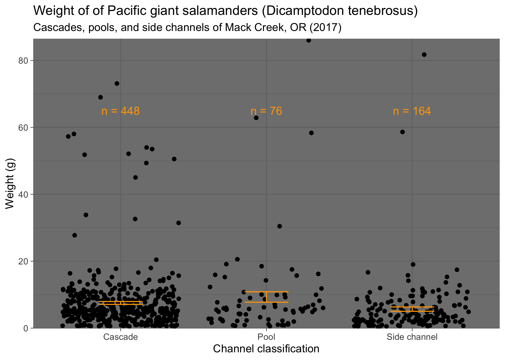

```{r setup, include=FALSE, warning = FALSE}
knitr::opts_chunk$set(echo = FALSE)
```


***Image 1:** A Pacific Giant Salamander (Dicamptodon tenebrosus), enjoys its lunch. (source: [Industrius Info](https://www.industrious.info/55/08768-pacific-giant-salamander-eating.html))*

### **Introduction**

Since 1993, data on Pacific Giant Salamanders has been collected in/along Mack Creek, part of the H.J. Andrews Experimental Forest in Western Cascade Mountains of Oregon. This data collection is part of a [larger effort](http://andlter.forestry.oregonstate.edu/data/abstract.aspx?dbcode=AS006), begun in 1987 to monitor local cutthroat trout populations (2). The H.J. Andrews Experimental Forest is a research site supported jointly by the University of Oregon and the U.S. Forest Service, and funded as part of the National Science Foundation’s Long-Term Ecological Research program (1). Data collection for Pacific Giant Salamanders occurs in two distinct areas, a coniferous old-growth forest and a clear-cut area (c. 1963) (2). Observations gathered pertaining to salamander abundance, weight, type, and location can provide insight as to how the species is affected by factors such as climate change, land use, and other disturbances over time (1).


***Image 2:** Location overview of H.J. Andrews Experiment Forest (source: [H.J. Andrews Experimental Forest](https://andrewsforest.oregonstate.edu/data/map))*

~

### **Data and Methods**

Data for Pacific giant salamander (Dicamptodon tenebrosus) abundance, size, and location from 1993-2017 were culled from the H.J. Andrews Experimental Forest LTER site. Salamanders were captured and measured using electrofishing equipment in Mack Creek, which flows through an upstream coniferous old growth forest and a downstream clear cut forest (harvested in 1963). Many variables were collected for each salamander observed, including weight and location both in the forest section and channel classification. Data were collected each year in August and September (1).

RStudio (version 1.2.5001) was used to produce figures and analyze data via $\chi$^2^ tests, 2-sample Welch's t-tests, analysis of variance (ANOVA) tests, and requisite post-hoc testing. A significance level of ($\alpha$) of 0.05 was used for all tests for statistical significance. 


***Image 3:** H.J. Andrews Experiment Forest (source: [H.J. Andrews Experimental Forest](https://andrewsforest.oregonstate.edu/data/map))*

~

### **Results**

```{r, include = FALSE}
library(tidyverse)
library(janitor)
library(beeswarm)
library(car)
library(ggbeeswarm)
library(kableExtra)
library(lubridate)
library(effsize)
library(DT)
library(plotly)
library(RColorBrewer)
```

#### A: Visualizing salamander abundance between old growth and clear cut sections of Mack Creek

```{r include=FALSE}
salamanders <- read_csv("mack_creek_vertebrates.csv") %>% 
  clean_names() %>% 
  filter(species == "DITE") %>% 
  mutate(sampledate = lubridate::mdy(sampledate)) %>% 
  mutate(year = lubridate::year(sampledate)) %>% 
  mutate(section = replace(section, section == "OG", "Old growth")) %>%
  mutate(section = replace(section, section == "CC", "Clear cut")) %>% 
  mutate(unittype = replace(unittype, unittype == "P", "Pool")) %>% 
  mutate(unittype = replace(unittype, unittype == "C", "Cascade")) %>%
  mutate(unittype = replace(unittype, unittype == "SC", "Side channel"))

salamanders_counted <- salamanders %>%
  count(year, section)

salamander_line <- ggplot(data = salamanders_counted,
                          aes(x = year,
                              y = n,
                              color = section)) +
  geom_line(size = 2) +
  theme_bw() +
  scale_x_continuous(expand = c(0,0)) + 
  scale_y_continuous(expand = c(0,0)) +
  labs(x = "Year", y = "Annual count") +
  ggtitle("Annual count of Pacific giant salamanders (Dicamptodon tenebrosus)", "Clear cut vs. old growth sections of Mack Creek, OR (1993-2017)") +
  ggsave("fig1.png")

salamander_line
```


***Figure 1:** Relative salamander abundance between clear cut and old growth sections of the Mack Creek drainage in the western foothills of the Oregon Cascades. Clear cut sections exhibited lower salamander abundances relative to old growth until the final three years of the study, but population trends between sections largely track with one another over this 24-year period.*

~

#### B: Salamander counts by channel classification

***Table 1:** Salamander counts by channel classification. In 2017, the highest abundance of salamanders in both clear cut (CC) and old growth (OG) forests were found in cascades (67.1% and 62.8%, respectively), followed by side channels (24.5% and 23.1%), and then pools (8.4% and 14.1%).*

```{r}

salamanders_2017 <- salamanders %>%   # contains only section, unittype, wight
  filter(year == "2017") %>% 
  select(section, unittype, weight) %>% 
  filter(unittype != "IP")


# finding salamander counts by section and unit type (cascade, pool, side channel)
salamander_2017_counts <- salamanders_2017 %>%  
  count(section, unittype)

# making a table / wider format / contingency table
salamander_2017_table <- salamander_2017_counts %>% 
  pivot_wider(names_from = unittype,
              values_from = n)

# making a nicer table! 
salamander_2017_props <- salamander_2017_table %>% 
  adorn_percentages(denominator = "row") %>% 
  adorn_pct_formatting(digits = 1) %>% 
  adorn_ns(position = "front") %>% 
  rename(Section = section)

kable(salamander_2017_props) %>% 
  kable_styling()

# Need to rename CC and OG to Clear cut and Old growth!
# Add table caption above table

```

~

#### C: Impacts of forest condition of salamander location


```{r, include = FALSE}
# Is there an effect of forest condition (OG vs. CC) on where salamanders are found (channel classification)?

chi_counts <- salamander_2017_table %>% 
  select(-section)

chi_counts
```


```{r, include = FALSE}
#H0:There is no significant association between forest condition and salamander location. Or, forest condition and salamander location are independent of one another.

salamander_chi <- chisq.test(chi_counts)

salamander_chi

```


In 2017, there is not a significant effect of forest condition (old growth/ clear cut) on where in the channel salamanders are found (cascade/pool/sidechannel) ($\chi$^2^(`r salamander_chi$parameter`) =`r round(salamander_chi$statistic,2)`, *p* = `r round(salamander_chi$p.value, 3)`)

~

#### D: Relationship between forest condition and mean salamander weights


```{r, include = FALSE}

salamander_17_d <- salamanders %>% 
  filter(year == "2017") %>% 
  select(section, weight)

# data exploration:

ggplot(data = salamander_17_d,
       aes(x = weight)) +
  geom_histogram() +
  facet_wrap(~section)
# both sections seem generally normally distributed...
 ggplot(data = salamander_17_d,
        aes(sample = weight)) +
   geom_qq() +
   facet_wrap(~section)
 # QQ plots do not show a normal distribution, but can still compare means. Because of CLT, sampling distribution of the means will be normal.

mean_weight_17 <- salamander_17_d %>% 
  group_by(section) %>% 
  summarize(mean_weight = mean(weight, na.rm = TRUE))  # exclueds observation 696 with no observed weight

# How likely is it that we could have found sample means that are at least this different (7.78, 6.58) by random chance if the true difference in population means is zero?

# H0: there is no difference in means/means are equal
# Null: means are not equal

salamander_ttest <- t.test(weight ~ section, data = salamander_17_d)

salamander_ttest

# p-value = 0.096, cannot reject H0
# conclusion: there is not a significant difference in weights between salamanders found in old growth forests vs. clear cut sections in 2017.

salamander_cohend <- cohen.d(weight ~ section, data = salamander_17_d) 
# is this necessary? since we cannot reject null hypothesis?

```
Mean salamander weights did not differ significantly between clear cut and old growth forests [t(693)= `r round(salamander_ttest$statistic,2)`, p= `r round(salamander_ttest$p.value,3)`]. The actual difference in mean values for clear cut and old growth forests is `r round(-diff(salamander_ttest$estimate),2)` grams. It should be noted that data for both locations are skewed, with distributions concentrated toward smaller weights.

~
 
#### E. Relationship between channel classification and mean salamander weights

```{r include=FALSE}
#Visualize

summary_2017 <- salamanders_2017 %>% 
  group_by(unittype) %>%
  summarize(
    mean_weight = mean(weight, na.rm = TRUE),
    sd_weight = sd(weight, na.rm = TRUE),
    se_weight = sd(weight, na.rm = TRUE) / sqrt(n()),
    sample_size = n(),
    var_weight = var(weight, na.rm = TRUE)
  )

graph_2017 <- ggplot() +
  geom_jitter(data = salamanders_2017,
                       aes(x = unittype,
                           y = weight)) +
  geom_errorbar(data = summary_2017,
                aes(x = unittype,
                    ymin = mean_weight - se_weight,
                    ymax = mean_weight + se_weight),
                color = "orange",
                width = .3) +
  theme_bw() +
  scale_y_continuous(expand = c(0,.5)) +
  labs(x = "Channel classification",
       y = "Weight (g)") +
  ggtitle("Weight of of Pacific giant salamanders (Onchorhyncus clarkii)", "Cascades, pools, and side channels of Mack Creek, OR (2017)") +
  theme_dark() +
  annotate("text",
           label = "n = 448",
           x = 1,
           y = 65,
           size = 4,
           color = "orange") +
  annotate("text",
           label = "n = 76",
           x = 2,
           y = 65,
           size = 4,
           color = "orange") +
  annotate("text",
           label = "n = 164",
           x = 3,
           y = 65,
           size = 4,
           color = "orange") +
    ggsave("fig2.png")

graph_2017

# ANOVA suitability - Levene's test

leveneTest(weight ~ unittype, data = salamanders_2017)

# ANOVA

salamander_aov <- aov(weight ~ unittype, data = salamanders_2017)
summary(salamander_aov)
aov_outputs <- unlist(summary(salamander_aov))

# Post-hoc testing

TukeyHSD(salamander_aov)

# Only significant difference is from SC-P

salamander_2017_sc_p <- salamanders_2017 %>% 
  filter(unittype %in% c("Side channel", "Pool"))

salamander_2017_t <- t.test(weight ~ unittype, data = salamander_2017_sc_p)

tukey_cohen <- cohen.d(salamander_2017_sc_p$weight, salamander_2017_sc_p$unittype)

# Small effect size
```


***Figure 2:** Mean weight distributions of Pacific giant salamanders between three different habitat types in Mack Creek. Error bars show standard error about the mean **(cascade mean weight = `r round(summary_2017$mean_weight[1], 2)` g, pool mean weignt = `r round(summary_2017$mean_weight[2], 2)` g, side channel mean weight = `r round(summary_2017$mean_weight[3], 2)` g)**. Standard error is lowest in the cascade classification (with the highest sample size) and highest in the pool classification (with the lowest sample size), demonstrating a better estimation of the population mean at larger sample sizes. Salamanders appear to favor cascades in greater numbers to pools and side channels.*

A Levene's Test revealed no significant difference in weight variances between pools, cascades, and side channels at the 0.05 significance level, so an analysis of variance (ANOVA) test is appropriate to investigate significant differences between these three channel classificiations.

An ANOVA revealed significant differences in mean salamander weight across cascades, pools, and side channels (F(`r aov_outputs[1]`, `r aov_outputs[2]`) = `r round(aov_outputs[7],2)`, *p* = `r round(aov_outputs[9],3)`).

Post-hoc Tukey's testing only revealed a significant difference in mean salamander weight between pools and side channels (F(df) = `r nrow(salamander_2017_sc_p) - 1`, p < 0.05), with a `r tukey_cohen$magnitude` effect size [Cohen's *d* = `r round(tukey_cohen$estimate, 3)`].

The small sample size of the pool classification relative to cascade and side channel may have inflated the effect of high weight outliers on the pool mean weight, leading to the highest mean weight of the three classes and a significant mean weight difference with side channels. Comparing medians may be a better option to decrease the impact of outliers on the measure of central tendency across samples of varying size.

Lower standard error in classifications with larger sample size is likely an effect of sample size, but the cascades classification with the highest sample size is likely preferred by salamanders, as opposed to a product of sampling error. These data do not present a particularly compelling relationship between salamander weight and channel classification, despite statistically significant results.

### **Summary**

- In both clear cut and old growth forest, salamanders were found in the highest abundance in cascades, as opposed to side channels or pools. 

- Forest condition does not have a significant effect on salamander location, nor does it have a significant effect of mean weights of salamander populations.

- Channel classification has a small but significant effect on mean salamander weights. Salamanders observed in pools had a significantly higher mean weight than salamanders observed in side channels, but the effect size was small and may have been affected by data skew.


### **References**

“Aquatic Vertebrate Population Study in Mack Creek, Andrews Experimental Forest, 1987 to Present.” LTER Network Data Portal, portal.lternet.edu/nis/mapbrowse?packageid=knb-lter-and.4027.12.

“H.J. Andrews Experimental Forest - Oregon State University.” H.J. Andrews Experimental Forest - Oregon State University, andrewsforest.oregonstate.edu/.

“Pacific Giant Salamander Eating.” Industrious Info, www.industrious.info/55/08768-pacific-giant-salamander-eating.html.
